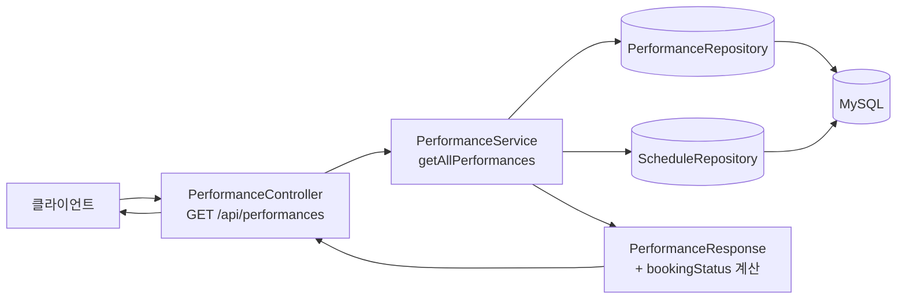
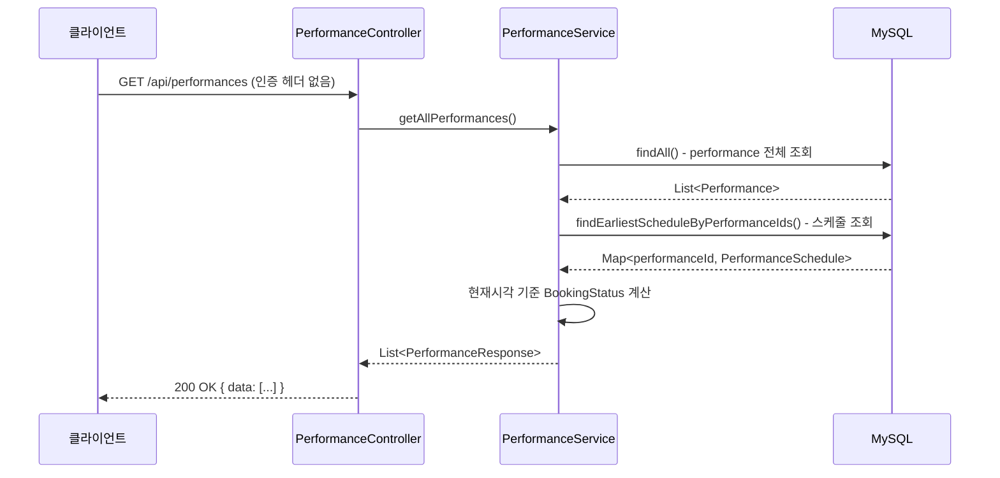
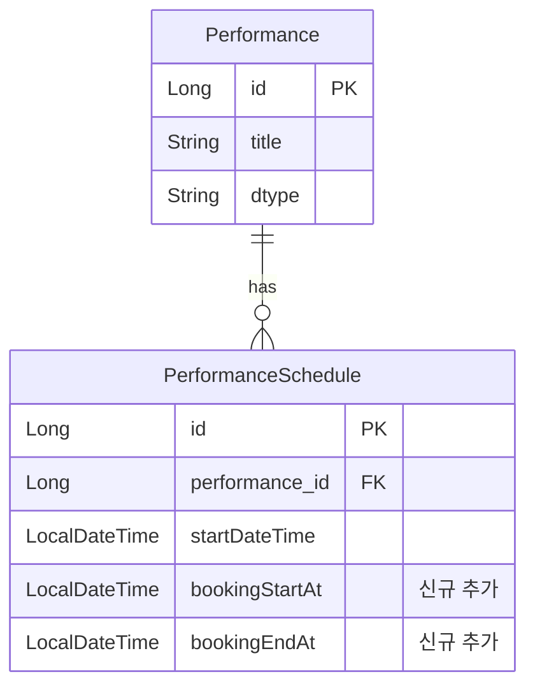

# 설계 문서: 예매 상태 포함 공연 목록 조회 API

## 1. 요구사항 요약

- 인증 없이 누구나 접근 가능한 공연 목록 API
- 콘서트·스포츠 경기 전체를 한 번에 반환
- 각 공연에 예매 상태(예매 예정 / 예매 중 / 예매 종료)를 함께 표시
- 예매가 끝난 공연도 목록에서 숨기지 않음

## 2. 목표와 비목표

**목표(Goals)**
- 기존 `GET /api/performances` 응답에 `bookingStatus` 필드 추가
- `PerformanceSchedule`에 `bookingStartAt`, `bookingEndAt` 컬럼 추가 (스키마 확장)
- 상태는 현재 시각 기준으로 서버 측에서 계산하여 반환

**비목표(Non-goals)**
- 상태별 필터링 파라미터 (이번엔 전체 목록만; 필터는 추후 확장)
- 페이지네이션 (공연 수가 적은 현재 규모에서 불필요)
- 관리자용 상태 수동 변경 기능

## 3. 시스템 구조



- **PerformanceController**: 기존 엔드포인트 재사용, 인터셉터 제외 경로 확인
- **PerformanceService**: 스케줄 목록을 조회해 공연별 bookingStatus 계산
- **PerformanceResponse**: `bookingStatus` 필드 추가, `BookingStatus` enum 도입

## 4. 데이터 흐름



## 5. 인터페이스 / API 스펙

**엔드포인트**

```
GET /api/performances
Authorization: 불필요 (공개 API)
```

**응답 예시**

```json
{
  "status": "OK",
  "message": null,
  "data": [
    {
      "id": 1,
      "type": "CONCERT",
      "title": "아이유 콘서트",
      "description": "아이유 (발라드)",
      "bookingStatus": "OPEN",
      "bookingStartAt": "2026-04-01T10:00:00",
      "bookingEndAt": "2026-05-01T23:59:59"
    },
    {
      "id": 2,
      "type": "SPORTS",
      "title": "KBO 개막전",
      "description": "LG vs KT",
      "bookingStatus": "UPCOMING",
      "bookingStartAt": "2026-05-01T10:00:00",
      "bookingEndAt": "2026-05-20T23:59:59"
    }
  ]
}
```

**BookingStatus 열거형**

| 값 | 의미 | 조건 |
|----|------|------|
| `UPCOMING` | 예매 예정 | 현재시각 < bookingStartAt |
| `OPEN` | 예매 중 | bookingStartAt <= 현재시각 <= bookingEndAt |
| `CLOSED` | 예매 종료 | 현재시각 > bookingEndAt |

스케줄이 여러 회차일 경우, **가장 이른 회차의** bookingStartAt/bookingEndAt 기준으로 판단한다.

## 6. 데이터 모델



**변경 사항**: `PerformanceSchedule`에 컬럼 2개 추가
- `booking_start_at DATETIME NOT NULL`
- `booking_end_at DATETIME NOT NULL`

`InitDb`(DataInit 포함)에서 초기 데이터 세팅 시 두 필드도 함께 주입해야 함.

## 7. 주요 결정 사항과 이유

**결정 1: 기존 엔드포인트 확장 vs 신규 엔드포인트**
- 기존 `GET /api/performances` 확장 선택
- 이유: 동일한 리소스(공연 목록)에 필드만 추가하는 것이므로 URL을 분리할 근거가 없음. 클라이언트 변경 최소화.

**결정 2: 상태 컬럼 저장 vs 계산**
- `bookingStartAt`, `bookingEndAt`을 DB에 저장하고, `bookingStatus`는 서버에서 계산 선택
- 이유: 상태를 DB에 저장하면 배치 업데이트가 필요해 복잡도가 높아짐. 시각 기준 계산이 단순하고 정확함.

**결정 3: 스케줄이 여러 회차일 때 기준**
- 가장 이른 회차(`bookingStartAt` 기준 min) 사용
- 이유: 사용자 관점에서 "가장 빠른 예매 기회"가 대표 상태로 가장 직관적임.

**결정 4: 기존 캐시(`@Cacheable`) 처리**
- 기존 `getAllPerformances()`에 붙은 Redis 캐시는 유지
- 단, `bookingStatus`는 시각에 따라 바뀌므로 캐시 TTL을 현재보다 짧게(예: 5분) 조정 필요
- 이유: 상태가 TTL 내에서 바뀔 수 있지만, 실시간성보다 성능이 더 중요한 목록 API임.

## 8. 미해결 이슈 / 확인 필요 사항

- `InitDb`에 `bookingStartAt`, `bookingEndAt` 초기 데이터를 어떤 값으로 넣을지 → 개발자 판단
- `GET /api/performances`가 현재 JwtInterceptor 제외 경로인지 확인 필요 (`WebConfig` 점검)
- 캐시 TTL 단축 범위 → 현재 설정값 확인 후 결정
